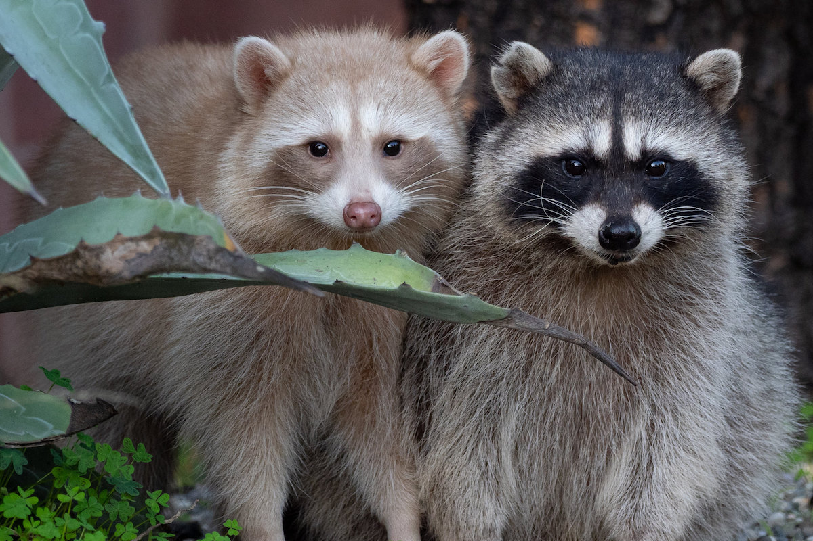

# A Curious Encounter with White Raccoons

Every now and then, nature throws in a quiet surprise.  
A white raccoon—standing side by side with its more familiar gray-brown counterpart—does exactly that. At first glance it looks almost unreal, like a trick of the light, but it’s simply a rare variation caused by leucism, not albinism.


*Image source: The Oaklandside (https://oaklandside.org)*

## A Brief Pause to Notice

White raccoons aren’t mythical creatures or urban legends. They’re just uncommon enough to make people stop, stare, and maybe smile. Unlike albino animals, they still have dark eyes and subtle markings—just washed in pale fur that helps them stand out in a crowd they didn’t ask to be part of.

## Writing Things Down

Much like spotting something rare in the wild, writing doesn’t need to be complicated. A few simple notes, some structure, and a bit of curiosity go a long way.

You can start with something as plain as:

```yaml
---
title: My Post Title
author: Anonymous
createdAt: 2026-02-07
updatedAt: 2026-02-08
tags: [tag1, tag2]
description: A short description
---
````

## What This Space Is For

Think of this as a place to collect small observations—technical or otherwise:

* Write in Markdown, plain text, or HTML
* Break thoughts into sections and tags
* Let folders shape the flow
* Drop in images when words aren’t enough
* Keep things fast, simple, and readable

Sometimes it’s a detailed guide.
Sometimes it’s just a white raccoon quietly reminding you to look twice.

Happy writing.
